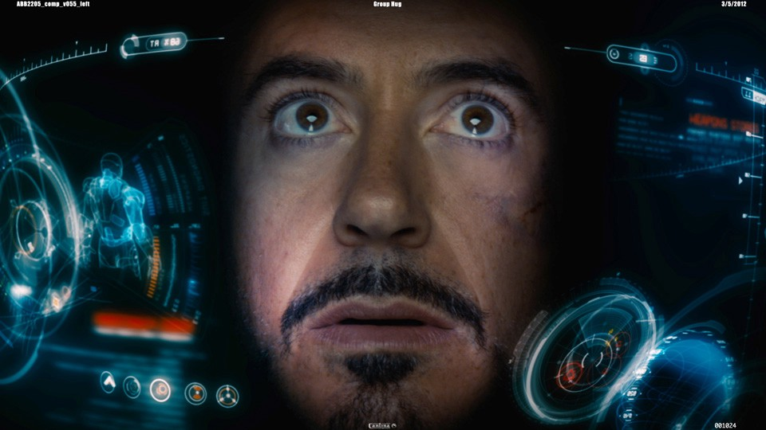
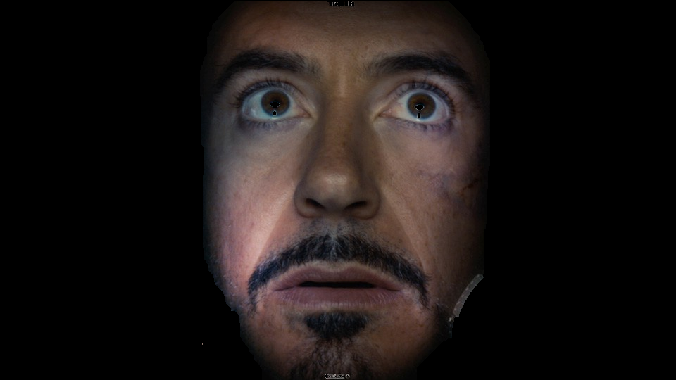

# Interactive_Image_Segmentation_with_graph-cut_OpenCV_python

# Library Installations:
 
- run: 
- pip install cv2
- pip install matplotlib
- pip install numpy

# Usuage
- python graphcut_segment.py

# Reference
- https://docs.opencv.org/3.4/d8/d83/tutorial_py_grabcut.html

If you like this work please help me by giving me some stars.
